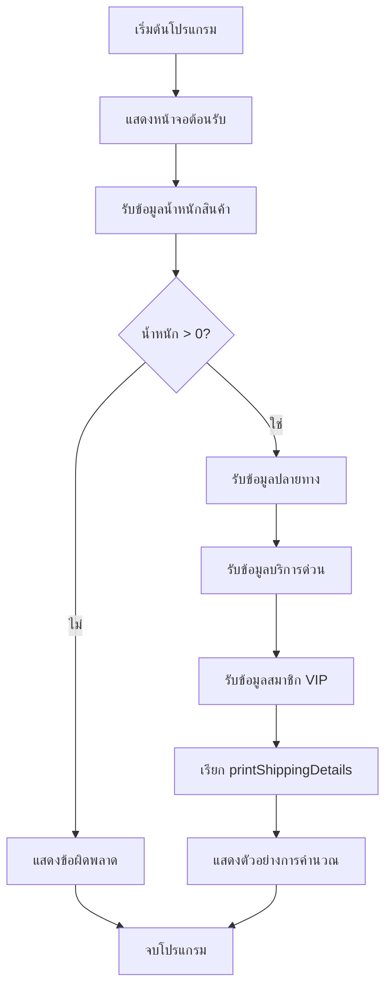
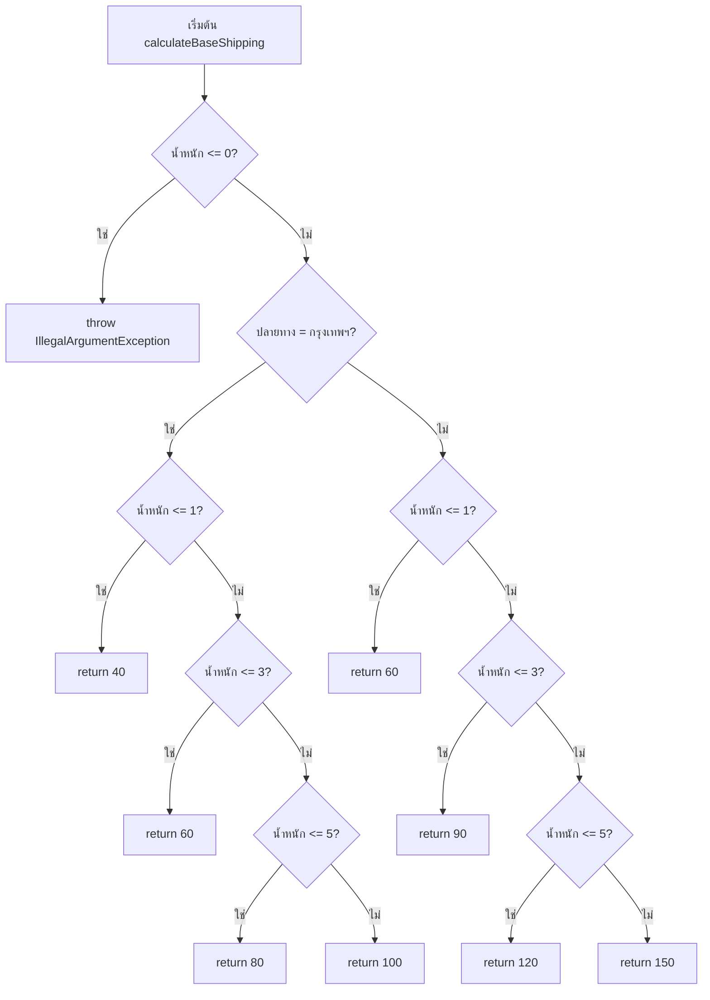
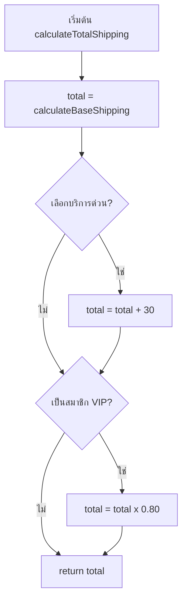
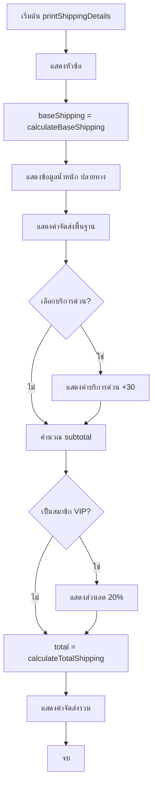
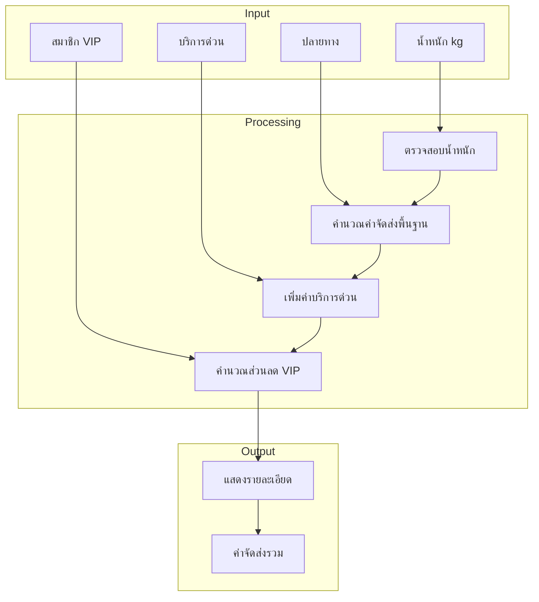

# ShippingCalculator - Flowchart และ Pseudo Code

## Flowchart (Mermaid)

### 1. Main Program Flowchart



### 2. calculateBaseShipping Flowchart



### 3. calculateTotalShipping Flowchart



### 4. printShippingDetails Flowchart



### 5. Overall System Flowchart



---

## Pseudo Code

### 1. Main Program

```
PROGRAM ShippingCalculator

BEGIN
    DISPLAY "ระบบคำนวณค่าจัดส่งสินค้า"
    DISPLAY "Shipping Cost Calculator"
    
    TRY
        DISPLAY "กรุณาใส่น้ำหนักสินค้า (กิโลกรัม): "
        INPUT weight
        
        IF weight <= 0 THEN
            DISPLAY "ข้อผิดพลาด: น้ำหนักต้องมากกว่า 0"
            EXIT
        ENDIF
        
        DISPLAY "ปลายทาง (1 = กรุงเทพฯ/ปริมณฑล, 2 = ต่างจังหวัด): "
        INPUT destination
        SET isBangkok = (destination == 1)
        
        DISPLAY "ต้องการบริการด่วน? (1 = ใช่, 0 = ไม่): "
        INPUT expressChoice
        SET isExpress = (expressChoice == 1)
        
        DISPLAY "เป็นสมาชิก VIP? (1 = ใช่, 0 = ไม่): "
        INPUT vipChoice
        SET isVIP = (vipChoice == 1)
        
        CALL printShippingDetails(weight, isBangkok, isExpress, isVIP)
        
    CATCH Exception
        DISPLAY "ข้อผิดพลาด: กรุณาใส่ข้อมูลที่ถูกต้อง"
    ENDTRY
    
    // แสดงตัวอย่างการคำนวณ
    DISPLAY "--- ตัวอย่างการคำนวณ ---"
    DISPLAY "1. สินค้า 2 กก. ส่งกรุงเทพฯ = " + calculateTotalShipping(2, true, false, false)
    DISPLAY "2. สินค้า 4 กก. ส่งต่างจังหวัด ด่วน = " + calculateTotalShipping(4, false, true, false)
    DISPLAY "3. สินค้า 6 กก. ส่งกรุงเทพฯ ด่วน VIP = " + calculateTotalShipping(6, true, true, true)
    
END PROGRAM
```

### 2. calculateBaseShipping Function

```
FUNCTION calculateBaseShipping(weight, isBangkok)
    
    // ตรวจสอบน้ำหนัก
    IF weight <= 0 THEN
        THROW "น้ำหนักต้องมากกว่า 0 กิโลกรัม"
    ENDIF
    
    // กำหนดอัตราค่าจัดส่ง
    IF isBangkok == TRUE THEN
        // กรุงเทพฯ และปริมณฑล
        IF weight <= 1 THEN
            RETURN 40
        ELSE IF weight <= 3 THEN
            RETURN 60
        ELSE IF weight <= 5 THEN
            RETURN 80
        ELSE
            RETURN 100
        ENDIF
    ELSE
        // ต่างจังหวัด
        IF weight <= 1 THEN
            RETURN 60
        ELSE IF weight <= 3 THEN
            RETURN 90
        ELSE IF weight <= 5 THEN
            RETURN 120
        ELSE
            RETURN 150
        ENDIF
    ENDIF
    
END FUNCTION
```

### 3. calculateTotalShipping Function

```
FUNCTION calculateTotalShipping(weight, isBangkok, isExpress, isVIP)
    
    // คำนวณค่าจัดส่งพื้นฐาน
    SET total = calculateBaseShipping(weight, isBangkok)
    
    // เพิ่มค่าบริการด่วน (ถ้าเลือก)
    IF isExpress == TRUE THEN
        SET total = total + 30
    ENDIF
    
    // ลดราคาสำหรับสมาชิก VIP (20%)
    IF isVIP == TRUE THEN
        SET total = total * 0.80
    ENDIF
    
    RETURN total
    
END FUNCTION
```

### 4. printShippingDetails Function

```
FUNCTION printShippingDetails(weight, isBangkok, isExpress, isVIP)
    
    DISPLAY "========================================"
    DISPLAY "       รายละเอียดค่าจัดส่งสินค้า"
    DISPLAY "========================================"
    
    // คำนวณค่าจัดส่งพื้นฐาน
    SET baseShipping = calculateBaseShipping(weight, isBangkok)
    
    // แสดงข้อมูลที่รับเข้า
    DISPLAY "น้ำหนักสินค้า: " + weight + " กิโลกรัม"
    
    IF isBangkok == TRUE THEN
        DISPLAY "ปลายทาง: กรุงเทพฯ และปริมณฑล"
    ELSE
        DISPLAY "ปลายทาง: ต่างจังหวัด"
    ENDIF
    
    IF isExpress == TRUE THEN
        DISPLAY "บริการด่วน: ใช่"
    ELSE
        DISPLAY "บริการด่วน: ไม่"
    ENDIF
    
    IF isVIP == TRUE THEN
        DISPLAY "สมาชิก VIP: ใช่"
    ELSE
        DISPLAY "สมาชิก VIP: ไม่"
    ENDIF
    
    DISPLAY "----------------------------------------"
    DISPLAY "ค่าจัดส่งพื้นฐาน: " + baseShipping + " บาท"
    
    // แสดงค่าบริการด่วน (ถ้ามี)
    IF isExpress == TRUE THEN
        DISPLAY "ค่าบริการด่วน: +30 บาท"
    ENDIF
    
    // คำนวณยอดรวมก่อนลด
    SET subtotal = baseShipping
    IF isExpress == TRUE THEN
        SET subtotal = subtotal + 30
    ENDIF
    
    // แสดงส่วนลด VIP (ถ้ามี)
    IF isVIP == TRUE THEN
        SET discount = subtotal * 0.20
        DISPLAY "ส่วนลด VIP (20%): -" + discount + " บาท"
    ENDIF
    
    // คำนวณและแสดงค่าจัดส่งรวม
    SET total = calculateTotalShipping(weight, isBangkok, isExpress, isVIP)
    DISPLAY "----------------------------------------"
    DISPLAY "ค่าจัดส่งรวม: " + total + " บาท"
    DISPLAY "========================================"
    
END FUNCTION
```

---

## ตารางสรุปตัวแปรและค่าคงที่

| ตัวแปร/ค่าคงที่ | ประเภท | ค่า | คำอธิบาย |
|---------------|--------|-----|---------|
| BKK_RATE_0_1_KG | int | 40 | ค่าส่ง กทม. 0-1 กก. |
| BKK_RATE_1_3_KG | int | 60 | ค่าส่ง กทม. 1-3 กก. |
| BKK_RATE_3_5_KG | int | 80 | ค่าส่ง กทม. 3-5 กก. |
| BKK_RATE_OVER_5_KG | int | 100 | ค่าส่ง กทม. >5 กก. |
| PROVINCIAL_RATE_0_1_KG | int | 60 | ค่าส่งต่างจังหวัด 0-1 กก. |
| PROVINCIAL_RATE_1_3_KG | int | 90 | ค่าส่งต่างจังหวัด 1-3 กก. |
| PROVINCIAL_RATE_3_5_KG | int | 120 | ค่าส่งต่างจังหวัด 3-5 กก. |
| PROVINCIAL_RATE_OVER_5_KG | int | 150 | ค่าส่งต่างจังหวัด >5 กก. |
| EXPRESS_FEE | int | 30 | ค่าบริการด่วน |
| VIP_DISCOUNT_RATE | double | 0.20 | อัตราส่วนลด VIP |
